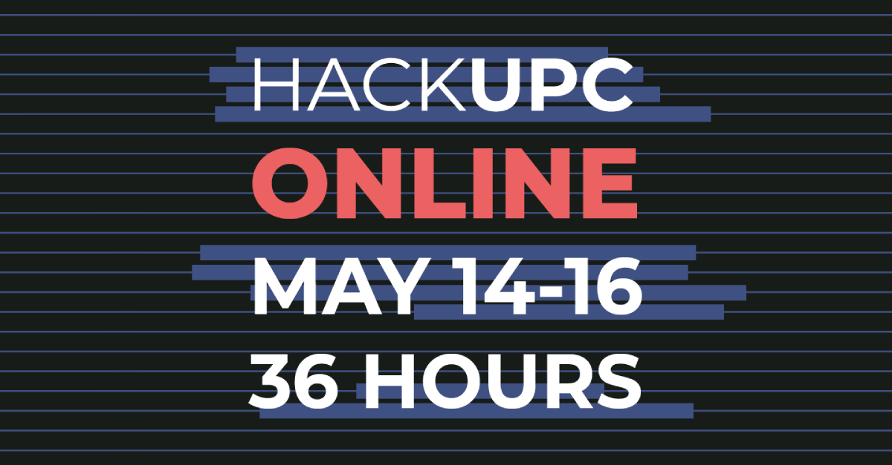

# HackUPC Live

[](https://app.netlify.com/sites/hackupc-live/deploys)
[](https://travis-ci.com/hackupc/hackupc-live)



Hi! This is the code of the HackUPC live page.

## Project Setup

1. Clone the repo.
   ```sh
   git clone https://github.com/hackupc/hackupc-live.git
   ```
1. Open it with [VSCode](https://code.visualstudio.com/) and install this extensions:

   - [Volar](https://marketplace.visualstudio.com/items?itemName=johnsoncodehk.volar) (and disable Vetur)
   - [TypeScript Vue Plugin (Volar)](https://marketplace.visualstudio.com/items?itemName=johnsoncodehk.vscode-typescript-vue-plugin).
   - [Prettier](https://marketplace.visualstudio.com/items?itemName=esbenp.prettier-vscode)
   - [EsLint](https://marketplace.visualstudio.com/items?itemName=dbaeumer.vscode-eslint)
   - [StyleLint](https://marketplace.visualstudio.com/items?itemName=stylelint.vscode-stylelint)
   - [MarkdownLint](https://marketplace.visualstudio.com/items?itemName=davidanson.vscode-markdownlint)
   - [Grammarly](https://marketplace.visualstudio.com/items?itemName=znck.grammarly)

1. Install [Node.js](https://nodejs.org/en/download/) (preferably with [nvm](https://github.com/nvm-sh/nvm#installing-and-updating)).
1. Install the dependencies:
   ```sh
   npm install
   ```
1. Run the project in development mode:
   ```sh
   npm run dev
   ```
1. Go to http://localhost:3000/ to preview the app.
1. Code. If you're not familiar with Vue 3, read its [official documentation](https://vuejs.org/guide), it's very good. BTW write tests if possible.

1. Open a Pull Request and ask for reviews to merge to `main`.
1. Whenever the PR is merged, [Netlify](https://app.netlify.com/sites/hackupc-live) will build and deploy automatically. 🧙🏻‍♂️

## Edit content

### Theme

Theme variables are in `src/live/params.scss`.

### Contents

Most of the content is in `src/data` or hardcoded into the components.

### Schedule

The schedule is in `src/data/schedule.ts`.

- `id` can be whatever you want, but all ids must be different.
- `dates` are D/M/YYYY format at Spain time.

## Commands

### Install dependencies

```sh
npm install
```

### Compile and Hot-Reload for Development

```sh
npm run dev
```

### Type-Check, Compile and Minify for Production

```sh
npm run build
```

### Run Unit Tests with [Cypress Component Testing](https://docs.cypress.io/guides/component-testing/introduction)

```sh
npm run test:unit # or `npm run test:unit:ci` for headless testing
```

### Run End-to-End Tests with [Cypress](https://www.cypress.io/)

```sh
npm run build
npm run test:e2e # or `npm run test:e2e:ci` for headless testing
```

### Lint with [ESLint](https://eslint.org/)

```sh
npm run lint
```

## Support

If you need help understanding something of this repo you can ask the previous developers. The ones that made this edition live were:

- Maurici Abad Gutierrez: Slack `@mauri` [mauriciabad.com](https://mauriciabad.com/) `done the most part`
- David Dionís: Slack `@David Dionis`
- Carlota Catot Bragós: Slack `@Carlota` [carlotacb.dev](https://carlotacb.dev/)
- Bernat Torres: Slack `@bernatixer` [bernattorres.com](https://bernattorres.com/)

## License

MIT © Hackers@UPC
